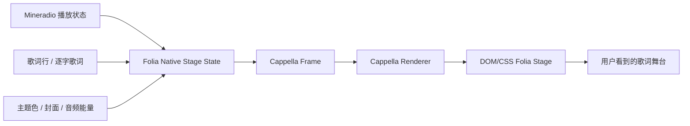

# Mineradio 原生 Folia Cappella 歌词舞台设计

## 1. 背景

当前 Mineradio 的 `歌词视觉增强` 已经提供 `classic / partita / monet / fume / tilt / cappella` 等 Folia 风格入口，但实际效果仍主要建立在 Mineradio 原有单行 3D 悬浮歌词之上。大部分预设只是调整歌词大小、偏移、倾斜、光晕和背景浓度，缺少 Folia 原版里更关键的舞台构图、消息流结构、头像贴纸、上下文歌词和无感转场。

因此继续调参数无法达到预期。新的方向是建立 Mineradio 原生 Folia Stage Engine：仍由 Mineradio 管理播放、歌词、主题、DIY 和音频分析，但选择 Folia 风格预设时，完全替代原有单行 3D 歌词，使用 DOM/CSS 原生舞台渲染对应风格。

## 2. 目标

第一阶段只专攻 `Cappella`，把它做成可感知接近 Folia 原版的聊天式歌词舞台。

目标体验：

- 选择 `歌词视觉增强 -> 声部 / Cappella` 后，原 Mineradio 单行 3D 歌词完全隐藏。
- 屏幕中央切换为 Cappella 风格歌词舞台。
- 歌词以左右气泡消息流呈现，包含上一句、当前句和后续句。
- 当前歌词气泡放大、聚焦、具备逐字高亮。
- 上下文歌词气泡降低透明度和尺寸，作为时间线氛围存在。
- 使用唱片封面或主题头像作为小圆形头像。
- 显示时间戳、音符贴纸或轻量反应元素。
- 切句、seek、切歌、切预设时不闪屏、不硬重置，保持无感过渡。

## 3. 非目标

本阶段不做以下内容：

- 不继续完善独立 Folia iframe 舞台。
- 不让 Folia 接管播放、歌单、音乐源或设置。
- 不复刻 Folia 的 Navidrome、Now Playing、本地库等平台功能。
- 不一次性复刻 `Partita / Monet / Fume / Tilt / Classic`。
- 不把气泡、头像、文字全部改成 Three.js 物体。
- 不改变 Mineradio 普通动态歌词、评论、天气、歌单架等现有能力。

## 4. 产品规则

### 4.1 舞台切换

歌词舞台遵循互斥规则：

```text
普通 Mineradio 歌词预设
  -> 使用原有 3D 动态歌词

Folia Cappella 预设
  -> 隐藏原有 3D 动态歌词
  -> 启用 Mineradio 原生 Folia Cappella Stage
```

用户不会进入 Folia 平台，也不会打开 Folia 单独页面。`Cappella` 是 Mineradio DIY 中的一个歌词视觉预设。

### 4.2 入口

入口仍在 Mineradio DIY：

```text
DIY
  -> 歌词视觉增强
    -> 启用增强歌词层
    -> 声部 / Cappella
```

临时独立 Folia 舞台入口可以继续作为参考入口存在，但不作为本阶段目标体验。

### 4.3 其他 Folia 风格预设

本阶段完成后：

- `Cappella` 使用新原生舞台。
- 其他 Folia 风格预设可以暂时保留旧效果或标注为后续升级。
- 不应让未完成预设伪装成完整复刻，以免用户误判。

## 5. 视觉设计

### 5.1 基础布局

Cappella 舞台是一个覆盖在主视觉上的 DOM 层：

```text
背景粒子 / 当前视觉预设
  + Cappella 歌词消息层
  + 轻量贴纸 / 氛围形状
  + 底部播放器
```

舞台不遮挡底部播放器主控，主歌词气泡处于视觉中心略偏下位置，左右上下文消息围绕它分布。

### 5.2 消息气泡

消息结构：

- `previous`：上一句或更早歌词，缩小、半透明。
- `active`：当前歌词，最大气泡，清晰高亮。
- `upcoming`：后续歌词，缩小、半透明。

每条消息包含：

- 时间戳。
- 头像。
- 歌词气泡。
- 当前句逐字高亮节点。

当前气泡应明显大于上下文气泡，但不能占满屏幕。长句需要换行，不能溢出屏幕。

### 5.3 头像与贴纸

头像优先级：

1. 当前歌曲封面裁切为圆形头像。
2. 无封面时使用主题色生成圆形头像。
3. 仍不可用时使用默认抽象头像。

贴纸第一阶段只做轻量音符/反应符号，不引入第三方图片资源，避免授权风险。

### 5.4 动效

动效要求：

- 新消息进入：轻微上浮、淡入、缩放。
- 旧消息离场：淡出、轻微后退。
- 当前句切换：旧当前句降级为 previous，新当前句升级为 active。
- seek：允许快速重排，但不闪白、不清空舞台。
- 切预设：Cappella 和普通歌词之间交叉淡入淡出。
- 切歌：保留上一帧短暂淡出，新歌歌词准备好后进入。

## 6. 技术架构

### 6.1 模块职责

#### `public/folia-native-stage-state.js`

负责将 Mineradio 当前歌词状态转为 Cappella 舞台状态。

职责：

- 根据当前时间找到 active lyric line。
- 提取 previous / active / upcoming。
- 生成稳定 message key，避免 DOM 频繁重建。
- 生成 words 状态：waiting / active / passed。
- 生成头像、时间戳、贴纸状态。
- 输出 renderer 可直接消费的 frame。

#### `public/folia-native-stage-renderers.js`

负责 Cappella DOM 渲染和局部更新。

职责：

- 渲染 Cappella 消息流 DOM。
- 对同一句歌词执行逐字 patch，而不是重建整棵 DOM。
- 对切句执行 message diff。
- 对贴纸和头像执行稳定 key 更新。
- 为后续 Partita / Monet 等 renderer 预留接口。

#### `public/folia-native-stage-ui.js`

负责挂载、显示隐藏和转场。

职责：

- 创建 `#folia-native-stage`。
- 接收每帧 frame。
- 判断 enter / update / crossfade / exit。
- 管理旧 frame ghost，保证无感切换。
- 和 Mineradio 原 3D 歌词互斥显示。

#### `public/styles/app.css`

负责 Cappella 的完整视觉表现。

职责：

- 舞台布局。
- 气泡样式。
- 头像、时间戳、贴纸。
- 响应式换行。
- 动效 keyframes。
- 低性能或减少动效模式。

### 6.2 数据流



### 6.3 原 3D 歌词互斥

当 `shouldUseFoliaNativeStageRuntime()` 返回 true：

- 不调用原 `showStageLine()` 创建新的主 3D 歌词。
- 已存在的原 3D 歌词淡出或隐藏。
- Folia Native Stage 接收当前歌词 frame 并显示。

当用户切回普通歌词预设：

- Folia Native Stage 执行 exit。
- 原 3D 歌词恢复当前播放位置对应歌词。

## 7. 无感切换策略

### 7.1 同一句歌词更新

同一句歌词内只更新 word state 和 progress，不重建消息气泡。

### 7.2 切句

切句时：

1. 当前 active message 降级为 previous。
2. 新 active message 从 upcoming 或新 frame 中接管。
3. 不清空整个舞台。

### 7.3 Seek

seek 后如果歌词跨度较大：

- 直接重排 previous / active / upcoming。
- 使用短 crossfade，避免消息流从头滚动。

### 7.4 切歌

切歌时：

- 如果新歌词未加载，显示短暂待机状态。
- 若有 intro/fallback 文案，使用 Cappella 风格气泡显示。
- 新歌词可用后进入正常消息流。

### 7.5 切预设

普通歌词和 Cappella 之间使用 crossfade。

不允许出现：

- 两套主歌词同时清晰显示。
- 歌词短暂消失。
- 旧歌词飞入动画反复播放。

## 8. 测试计划

### 8.1 单元测试

新增或扩展：

- `tests/folia-native-stage-state.test.js`
  - 能构建 previous / active / upcoming。
  - 能生成稳定 message key。
  - seek 后 frame 安全。
  - words 状态随播放时间变化。
  - 长句和空歌词安全降级。

- `tests/lyric-visual-presets.test.js`
  - Cappella 预设启用 Folia Native Stage。
  - 普通预设不启用 Folia Native Stage。
  - 切换预设保留可恢复状态。

- `tests/smoke.test.js`
  - Cappella 使用原生 stage renderer。
  - 原 3D 歌词和 Cappella 舞台互斥。
  - 不出现 `进入 Folia 平台` 这类平台化入口文案。

### 8.2 静态验证

每阶段执行：

```bash
npm run check
npm test
git diff --check
```

### 8.3 手动验收

场景：

1. 播放有普通 LRC 的歌曲。
2. 播放有逐字歌词的歌曲。
3. 切到 `歌词视觉增强 -> 声部 / Cappella`。
4. seek 到不同位置。
5. 连续切歌。
6. 在 Cappella 与普通歌词预设之间来回切换。
7. 窗口缩放到较小尺寸。

验收标准：

- 原 3D 歌词被完全替代。
- Cappella 舞台不闪屏。
- 当前句气泡明显聚焦。
- 上下文消息层次清楚。
- 逐字高亮稳定。
- 长句不溢出。
- 底部播放器不被遮挡。

## 9. 阶段拆分

### 阶段 1：Cappella 状态模型

目标：让 state 层能稳定输出完整 Cappella frame。

提交信息建议：

```text
feat: 建立 Cappella 原生歌词舞台状态模型
```

### 阶段 2：Cappella Renderer

目标：实现消息流 DOM、逐字 patch 和气泡布局。

提交信息建议：

```text
feat: 实现 Cappella 原生歌词舞台渲染器
```

### 阶段 3：舞台互斥与无感切换

目标：Cappella 完全替代原 3D 歌词，并保证切换不闪。

提交信息建议：

```text
feat: 接入 Cappella 歌词舞台无感切换
```

### 阶段 4：视觉抛光

目标：调气泡、头像、贴纸、响应式、动效节奏，让效果明显接近 Folia Cappella。

提交信息建议：

```text
polish: 优化 Cappella 歌词舞台视觉细节
```

## 10. 风险与约束

- 当前 `public/index.html` 仍然很大，接入点要克制，避免继续扩大上帝文件。
- DOM 舞台和 Three.js 背景叠加时要注意 z-index、pointer-events 和底部控制条。
- 逐字高亮频繁 patch 需要控制 DOM 更新粒度，避免低端设备卡顿。
- Folia 原项目资源和图片不能直接复制，除非明确授权；第一阶段只用自制 CSS/SVG/文字符号。
- 临时独立 Folia 舞台入口只是参考入口，不应影响原生 Cappella 的验收标准。

## 11. 成功标准

第一阶段完成后，用户切到 `Cappella` 时，应该能明显感到这不是 Mineradio 单行 3D 歌词换皮，而是一套完整的聊天式歌词舞台。

最低成功标准：

- 原 3D 歌词完全被替代。
- Cappella 气泡消息流稳定可用。
- 当前句、上下文、头像、时间戳、贴纸、逐字高亮都存在。
- 切句、seek、切歌、切预设无明显闪烁。

进一步成功标准：

- 肉眼观感接近 Folia Cappella。
- 其他 Folia 预设可以在同一 stage engine 下继续扩展。
