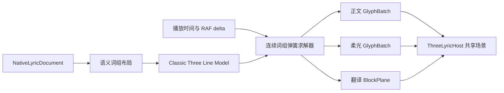

# 流光 Three.js 视觉重建设计

> 日期：2026-07-11  
> 状态：用户已确认；三轮规格复核完成，最终边界修订已纳入，等待实施计划  
> 分支：`codex/develop-local-library-migration`  
> 参考：`third_party/folia-major@baa5e846b7404f1893e8b7812bca79e959f21d3f`

## 1. 背景

当前 `classic` 已接入 Mineradio 共享 Three.js 场景，但视觉质量没有保留 Folia 流光的核心特征。自动截图虽然证明画面非空、资源有界、货架可点击，却不能证明动态观感正确。

对照 Folia `src/components/visualizer/classic/Visualizer.tsx`、原版预览图和当前 Three 截图后，确认问题来自五个实现差异：

1. Folia 以词组为动画单元，当前实现却为每个字形生成独立深度和状态变换，文字轮廓被空间扭曲压过。
2. Folia 使用连续弹簧过渡；当前 Three 状态在 `waiting / active / passed` 之间直接跳变，没有状态间插值。
3. Folia 将清晰正文和文字辉光分成两层；当前 shader 只提高正文亮度，没有真正的扩散柔光。
4. Folia 使用主题字体；当前 Three 固定为 `Noto Sans SC`，没有跟随 Mineradio 的歌词字体和字重。
5. 当前翻译靠近主句且独立于选定空间设计，主次层级和间距均不稳定。

## 2. 已确认方向

用户选择“浅景深融合”，并确认以下规则：

- 字体、字重和主题色跟随 Mineradio 当前歌词设置。
- 3D 只作用于词组；一个词组内的单字保持共面。
- 词组按真实歌词时间依次弹出，不允许整句同时弹出。
- 当前字执行扫光并使用独立柔光层；唱过后恢复主题主色。
- 旧句模糊淡出，新句按词组时序执行弹簧进入。
- 翻译与主歌词处于同一空间组，一起参与呼吸和浅景深。
- 镜头仅提供严格受限的轻微视差，不叠加低频节拍位移。

## 3. 目标

1. 恢复 Folia 流光的语义词组排版、连续弹簧、逐字扫光、独立柔光和换句节奏。
2. 使用 Mineradio 共享 Three.js 场景提供浅层空间感，不创建第二个 Renderer、Canvas、RAF 或 AudioContext。
3. 保持歌词清晰度优先；3D 不能改变词组内部字距、字形比例或共面关系。
4. 保留同模式 DOM 后备、性能预算、资源上限和货架交互边界。
5. 建立动态验收，避免再次用单张“非空截图”替代运动质量验证。

## 4. 非目标

- 不把其他六种 Folia 模式迁移到 Three.js。
- 不修改 Mineradio 播放器、音乐库、主题生成或设置框架。
- 不引入 React、Framer Motion、SDF 字体包或新的运行时依赖。
- 不恢复已移除的回环效果。
- 不通过扩大随机旋转、单字深度或相机摆动制造“更 3D”的假象。

## 5. 总体结构



### 5.1 保留的边界

- `public/folia-native/runtime.js` 继续只拥有一个活动渲染器。
- `public/folia-native/three/host.js` 继续拥有共享字形图集、材质池、作用域和过渡资源。
- `public/folia-native/renderers/adaptive-three.js` 继续在 `classic` 公共模式内管理 Three 主实现和 DOM 后备。
- `public/folia-native/dom-state.js` 继续提供 Folia 语义布局与 render hints，不复制一套分叉规则。

### 5.2 重建的边界

- `public/folia-native/classic-three-state.js` 改为输出“词组 + 词组内局部字形”，而不是直接为每个字形决定随机空间姿态。
- `public/folia-native/renderers/classic-three.js` 使用两个共享批次分别绘制正文和柔光。
- `public/folia-native/three/material-pool.js` 为正文和柔光提供不同 shader 变体。
- `public/index.html` 向 Classic renderer 注入 Mineradio 当前字体、字重和受限视差信号。

## 6. 布局模型

### 6.1 语义词组

词组边界不直接使用 `buildDisplayWordsFromLayoutUnits()`。该 Folia helper 会将 semantic CJK unit 重新展开为原始 parser words，因此增强歌词可能退化为单字动画。已确认的预览选择“语义词组依次弹出”，所以 Three 版明确使用以下规则；这是对 Folia 排版层的受控调整，而不是声称原版始终按 2-4 字弹出。

1. 先调用 `buildPostLyricLayoutUnits(line, { semantic: true, sticky: true })`。
2. 非 CJK unit 保持原 parser word 边界；缩写和尾随标点使用 sticky unit 作为一个词组。
3. CJK semantic unit 直接作为词组，不再展开为原始单字 words。
4. 单字 CJK unit 在与相邻 CJK unit 的时间间隔不超过 120ms、合并后不超过 4 个正文 grapheme 时，优先向后合并；句末则向前合并。
5. 超过 4 个正文 grapheme 的 CJK unit 优先在原 parser word 边界做均衡拆分；不得跨越大于 120ms 的时间间隔或句读标点。
6. 如果单个 CJK parser word 本身超过 4 个正文 grapheme，则允许只在该 word 内部按 grapheme 边界创建视觉切片，但不修改 `NativeLyricDocument`。设正文 grapheme 数为 `n`、切片数为 `k = ceil(n / 4)`、基础长度为 `q = floor(n / k)`、余数为 `r = n % k`；从左到右前 `r` 片取 `q + 1` 字，其余片取 `q` 字。这样 5、7、9、10 字固定拆为 `3+2`、`4+3`、`3+3+3`、`4+3+3`，且每片保持 2-4 字。每个 word 内视觉切片都是独立时间所有者和前后硬边界，不得再与相邻 parser word 合组；仅最后一片允许附着紧随其后的零正文标点。
7. word 内部切片时间优先使用现有 `buildWordGraphemeTimings()`：切片开始时间取首 grapheme start，结束时间取末 grapheme end。若原 word 没有有效逐字时间，则按 grapheme 数量在原 word 的 `[startTime, endTime]` 内等比例分配；所有结果必须单调、有界且不得越过原 word 时间范围。
8. `Intl.Segmenter` 不可用时，按相同的 120ms 间隔与 2-4 字上限对连续 CJK parser words 做确定性分块。
9. 标点附着到前一词组且不计入 4 字正文上限；无法安全合并的单字允许独立成组，不能为了凑字数跨越明显时间边界。

普通词组的 `startTime` 取第一个原始 word 的开始时间，`endTime` 取最后一个原始 word 的结束时间。规则 6 生成的 word 内部视觉切片是唯一例外：每片必须使用规则 7 得到的切片开始与结束时间，不能退回整个原 word 的时间；因此各片按自身时间依次进入，而不是同时弹出。词组内部继续保存对应的原始 word 与 grapheme timing，因此词组整体弹簧不会丢失逐字扫光精度。

每个词组保存：

```text
groupKey
startTime / endTime
centerX / centerY
entryPose / activePose / passedPose
localGlyphs[]
projectedBounds
```

`localGlyphs` 仅保存相对于词组中心的局部位置、字形尺寸、逐字时间和图集引用。词组变换统一应用于组内全部字形，从数学上保证：

- 同一词组全部字形具有相同 Z；
- 字形之间的局部距离不会被逐字缩放破坏；
- 旋转围绕词组中心发生，而不是每个字单独旋转；
- 一个词组的正文层和柔光层使用完全相同的变换矩阵。

### 6.2 字体与测量

- 字体族来自 `lyricFontStackForKey(fx.lyricFont)`。
- 字重来自 `lyricFontWeightValue()`。
- 图集样式键必须包含完整字体栈、字重、字号、DPR 和 glow padding 档位。
- 字体栈以合法 CSS font-family 形式传给 Canvas，不得把整个逗号分隔栈错误地包成一个字体名。
- 字体或字重变化时清除 Classic 行模型；旧图集页按既有租约和 LRU 规则回收。

### 6.3 安全排版

- 主句使用安全区可用宽度的最多 92%。
- 拟合计算使用词组最大活动包络，而不是静态字宽，避免活动词组放大后与相邻词组重叠。
- 默认活动放大限制为 `1.08`，不复用原版最高约 `1.4x` 的强放大。
- 词组局部旋转限制为 `±2°`，基础深度限制为 `±0.08` world unit。
- 翻译位于主句下方固定间距，局部 Z 约为 `-0.025`，并计入同一个整体安全边界。

## 7. 连续动画模型

### 7.1 词组进入

按 render profile 使用 Folia 原有 lookahead：

| Profile | Lookahead |
| --- | ---: |
| normal | 150ms |
| fast | 80ms |
| instant | 30ms |

进入动画以词组时间为唯一时钟。使用与 Folia `stiffness=200, damping=20, mass=1` 对应的解析二阶弹簧，不保存跨帧积分状态。解析弹簧的标准收敛窗口固定为 420ms，再按 `wordRevealMode` 对时间轴做确定性缩放：

| `wordRevealMode` | 进入窗口 | 解析时间映射 |
| --- | ---: | --- |
| normal | 420ms | `springTime = elapsed` |
| fast | 240ms | `springTime = elapsed * 420 / 240` |
| instant | 120ms | `springTime = elapsed * 420 / 120` |

`elapsed` 从 `group.startTime - lookahead` 起算并限制在对应进入窗口内。令原始解析阶跃响应为 `S(t) = 1 - exp(-10t) * (cos(10t) + sin(10t))`，窗口归一化进度为 `u = clamp(elapsed / entryDuration, 0, 1)`；实际插值进度固定使用 `P(u) = S(u * 0.42) / S(0.42)`，并在 `u = 1` 后保持 active pose。端点归一化保留原弹簧的轻微过冲，同时使每个 profile 在自己的窗口末尾精确回到 `1`，不依赖不准确的“420ms 已自然完全收敛”假设。这样可同时满足：

- 连续播放时保留同一条轻微过冲曲线，并在 normal/fast/instant 下分别于 420/240/120ms 内收敛；
- Seek 后可直接求出目标时刻状态；
- 低帧率或丢帧不会改变最终轨迹；
- 暂停时只需冻结歌词时钟。

词组从受限 waiting pose 进入 active pose：

- opacity：`0 -> 1`
- scale：`0.84 -> 1.00~1.08`
- Z：最多从 `-0.06` 到词组基础深度
- X/Y：从确定性小偏移收敛到排版位置
- rotation：从最多 `±2°` 收敛到目标角度

### 7.2 活动与唱后状态

- active 只增加最多 `+0.035` 的词组前移，不改变组内字距。
- `active -> passed` 也使用绝对播放时间连续求解，禁止状态跳变。`passedStart = getClassicWordActiveEndTime()`；求解器先计算 `entryBoundaryPose = evaluateEntrySpring(passedStart)`，再从这个边界时刻的实际姿态插值到 passed pose，不能假定短词组已经到达固定 active pose。
- `now < passedStart` 时只求解进入弹簧；`now >= passedStart` 时固定使用 `entryBoundaryPose` 作为 passed 插值起点。normal/fast/instant 的 passed 时长分别为 500ms、240ms、120ms，并使用 smoothstep 回到基础尺度、基础深度和最低 `0.82` opacity。
- 正文颜色回落独立于空间 pose：normal/fast/instant 分别使用 800ms、240ms、120ms 从 highlight 返回主题主色。
- 唱后旋转在 pose 过渡结束后按绝对时间线性漂移，5 秒内最多增加 `±3°`，不采用原版最高 `45°` 的强旋转。
- Seek 直接用目标播放时间计算 passed 插值和旋转；不会从 active pose 重新补播。
- 整行呼吸沿用 Folia 时长，但位移上限压缩到 6px 等效世界距离。

### 7.3 逐字扫光

正文层和柔光层都读取 grapheme timing：

- 当前字正文由主色平滑过渡到 highlight，再回到主色。
- 柔光层只在当前字及有界尾迹内可见。
- normal 模式保留逐字尾迹；fast 和 instant 使用更短峰值，不补播已经错过的字符动画。
- 暂停冻结扫光进度；轻微整行呼吸和镜头视差可继续。

### 7.4 换句

`lineTransitionMode` 和 `wordRevealMode` 独立生效，不能互相覆盖：

| 配置 | 只控制 | 规则 |
| --- | --- | --- |
| `lineTransitionMode=normal` | 旧句退出 | 300ms 模糊淡出并轻微放大 |
| `lineTransitionMode=fast` | 旧句退出 | 160ms 模糊淡出 |
| `lineTransitionMode=none` | 旧句退出 | 120ms 纯淡出，不执行位移 |
| `wordRevealMode=normal` | 新句词组与逐字扫光 | 150ms lookahead，完整弹簧与尾迹 |
| `wordRevealMode=fast` | 新句词组与逐字扫光 | 80ms lookahead，缩短扫光尾迹 |
| `wordRevealMode=instant` | 新句词组与逐字扫光 | 30ms lookahead，120ms 内完成进入与峰值 |

例如 `lineTransitionMode=normal + wordRevealMode=instant` 时，旧句仍执行 300ms 退出，新句词组按 30ms lookahead 快速依次进入。

- 新句不以整句动画进入；每个词组仍按自身时间和 lookahead 依次触发。
- 旧句使用受管 Three RenderTarget 过渡层，340ms 内强制释放。

## 8. 正文与柔光材质

### 8.1 正文层

- 使用 normal blending、清晰 atlas alpha、`depthWrite=false`、`depthTest=true`。
- 每实例继续携带 UV、tint、opacity、progress 和 matrix。
- 正文字形不使用模糊采样，避免粗重和发虚。

### 8.2 柔光层

- 与正文共享 atlas 页面和实例矩阵，使用 additive blending。
- shader 在字形 UV 边界内执行有界多点 alpha 采样，禁止采到相邻字形单元。
- quality 使用 9-tap，balanced 使用 5-tap，battery 使用低成本 3-tap 或扩大透明 quad。
- glow 强度和半径由逐字时间驱动，不允许整词常驻高亮。
- atlas 单元预留足够 glow padding；页面、字节和租约上限保持不变。

## 9. 翻译与镜头

### 9.1 翻译

- 翻译继续使用 BlockPlane，以真实字体和字重重绘。
- 翻译是歌词空间组的子节点，继承整行呼吸、浅景深和镜头视差。
- 翻译不继承单个词组弹簧，也不执行逐字扫光。
- 主句与翻译间距进入布局 cache key，任何尺寸下不得相交。

### 9.2 镜头视差

- ThreeLyricHost 继续将歌词锚定在摄像机前方。
- Classic line group 额外接收受限局部视差：旋转最大 `±0.7°`，平移最大约 `0.03` world unit。
- 视差来自 Mineradio 当前镜头相对基线的角度，不读取音频频谱，不响应低频节拍。
- reduced motion、battery 档或货架交互冲突时，视差归零。

## 10. 生命周期、缓存与回退

- 文档、字体、配置、viewport 或安全区变化时清除行模型。
- 模型只保留当前句、下一句和最近句，最多 3 条。
- 字形图集继续限制为 4 页、32MB；淘汰页面必须同步退休共享材质。
- 两个 GlyphBatch 在 scope release 时同步释放；无活动实例的页面批次立即销毁。
- WebGL context lost、挂载异常、更新异常或持续超预算时切换同模式 DOM 后备。
- 后备期间用户配置仍为 `classic`；换歌后才允许重新尝试 Three。
- background release 清除作用域、过渡层和私有缓存，host 可保留受限共享页。

## 11. 性能降级

| Level | 调整 |
| --- | --- |
| 0 | 完整正文、9/5-tap 柔光、浅景深、镜头视差 |
| 1 | 降低柔光采样与尾迹长度 |
| 2 | 关闭镜头视差，压缩词组深度 50% |
| 3 | 关闭柔光模糊，只保留当前字颜色扫过 |
| fallback | 切换 DOM 流光，模式 ID 不变 |

现有五秒窗口性能预算继续生效。一次 track 内只允许单向降级，不自动来回抖动。

## 12. 可访问性

- 视觉字形和翻译平面继续不参与 DOM 语义树。
- `#native-lyric-live` 仍是唯一实时歌词语义来源。
- live region 只在当前句或翻译变化时更新，不随逐字扫光重复播报。
- reduced motion 关闭弹簧过冲、词组深度、镜头视差和唱后漂移，保留快速淡入与颜色变化。

## 13. 测试设计

### 13.1 单元测试

- 同一词组所有字形 Z 相同，局部字距在 waiting/active/passed 间不变。
- 固定测试词组之间至少间隔 500ms；在各自进入前、中、后关键时间点断言只有预期词组处于弹簧区间，避免用“同一帧”这种依赖刷新率的条件。
- 单个 5、7、9、10 字 CJK parser word 分别生成 3+2、4+3、3+3+3、4+3+3 的视觉切片；各片使用独立且连续的时间区间，逐字时间单调且不越过原 word 区间。
- 在 `activeEndTime - epsilon / activeEndTime / activeEndTime + epsilon` 三个时间点验证位置、尺度、深度和 opacity 连续，不允许短词组在 passed 边界跳到固定 active pose。
- 覆盖 `lineTransitionMode` 与 `wordRevealMode` 的交叉组合，验证旧句退出只服从前者、新句词组进入只服从后者。
- 解析弹簧在任意 RAF 间隔下对同一播放时间产生相同结果。
- normal/fast/instant lookahead 与 line transition 时长正确；端点归一化后的 instant 进入轨迹在 120ms 时精确等于 active pose，且 119ms 与 120ms 两帧之间的各归一化通道差值不超过 `0.005`。
- 逐字 glow 只覆盖当前字和有界尾迹。
- 暂停冻结弹簧与扫光；Seek 直接解析目标状态。
- 翻译继承 line group 变换但不继承 word group 变换。
- 字体栈和字重进入 atlas/model cache key。
- 柔光批次、atlas 页面和退休材质全部按生命周期释放。

### 13.2 Playwright 动态验收

固定歌词至少包含三个有独立时间的语义词组，并在以下关键帧截图和读回矩阵：

1. 第一词组进入前；
2. 第一词组弹簧中段；
3. 第一词组稳定且逐字扫光；
4. 第二词组进入而第三词组仍等待；
5. 换句模糊淡出；
6. 暂停 500ms 后的稳定状态；
7. Seek 到句中后的直接解析状态。

覆盖 `390x844`、`960x540`、`1366x768`、`1920x1080`。每个尺寸必须验证：

- 主句和翻译均在安全区内且不相交；
- 字形可读、无压扁、无逐字随机透视；
- 正文和柔光是两个独立批次；
- stage/side 货架真实点击保持有效；
- 20 次模式切换后只有一个 renderer、零过渡层、零退休材质。

### 13.3 性能验收

- 自动化 SwiftShader 只验证资源、回退和边界，不签收硬件 FPS。
- 参考硬件为 Windows 11 Pro build 26200、Intel Core i5-14600KF、NVIDIA GeForce RTX 5060、驱动 32.0.15.8097。1080p balanced 与 4K quality 均要求平均帧率不低于 57FPS、RAF p95 不高于 22ms；battery 要求平均帧率不低于 29FPS、RAF p95 不高于 40ms。
- 每档先预热 2 秒，再采样 15 秒，并记录 WebGL renderer、long task 总时长、最大 long task、atlas bytes、draw batches 和 heap growth。
- 连续切歌和模式切换后 heap 增长不超过既有 20MB 门槛。

## 14. 成功标准

- 视觉上不再出现粗重固定字体、单字随机深度、状态瞬间跳变、正文假辉光或翻译贴主句。
- 中文歌词优先表现为 2-4 字语义词组按真实时间依次弹出；时间边界不允许安全合并时可保留单字组，长 semantic unit 按第 6.1 节规则拆分。
- 词组有可感知但克制的空间层次，单字始终保持平面和正确字距。
- 动态测试能区分“整句同时进入”和“词组依次进入”。
- 同模式 DOM 后备、共享 Renderer、货架点击、资源上限和构建流程均无回归。

## 15. 风险与控制

| 风险 | 控制 |
| --- | --- |
| 柔光采样造成 atlas 串色 | 增加单元 padding，并在 shader 内限制 UV 采样边界 |
| 两批次提高 GPU fill rate | 质量分档降低 tap 数和尾迹长度 |
| 字体变化导致图集频繁重建 | 规范字体 cache key，保留 4 页 LRU 上限 |
| 词组放大重新产生重叠 | 使用活动包络进行预排版，放大上限 1.08 |
| 视差影响货架交互或阅读 | 视差只作用歌词局部组并设置硬上限，货架打开时归零 |
| Seek 触发错误补播 | 使用绝对时间解析弹簧，不依赖跨帧积分状态 |
