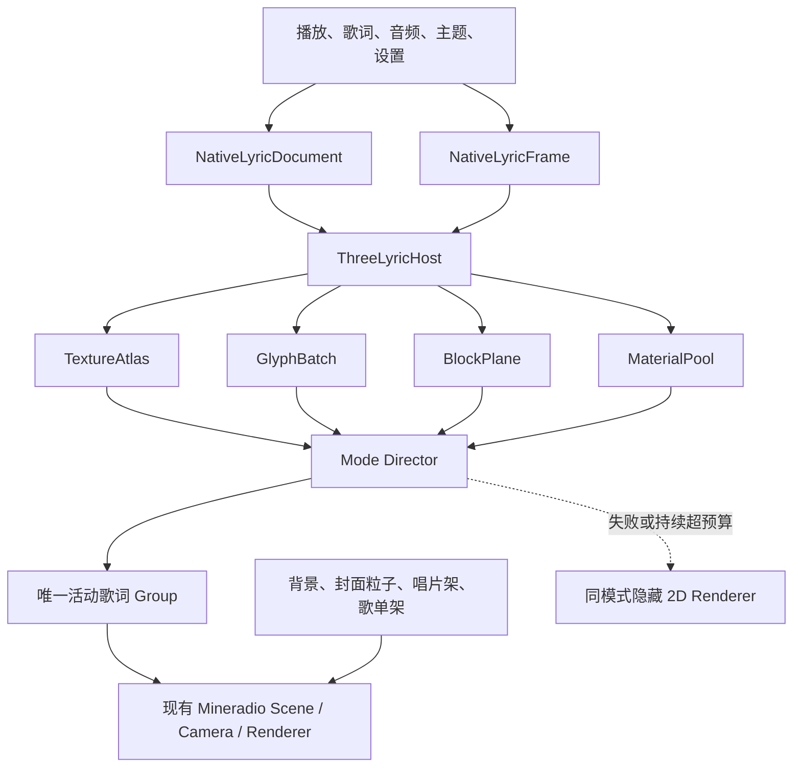

# Folia 七种歌词效果纯 Three.js 融合设计

**日期：** 2026-07-11  
**状态：** 已在对话中确认  
**目标分支：** `codex/develop-local-library-migration`  
**关联计划：** `docs/superpowers/plans/2026-07-10-folia-native-lyrics-integration.md`

## 1. 目标

将 Mineradio 中已经原生迁移的 Folia 七种歌词效果进一步改造为纯 Three.js 可见渲染层：

- `classic`：流光。
- `cadenza`：心象。
- `partita`：云阶。
- `tilt`：倾诉。
- `monet`：莫奈。
- `cappella`：群唱。
- `fume`：浮名。

七种模式保留各自的排版、材质、色彩和节奏，只将文字、背景及装饰元素转换为 Three.js 对象。空间距离、镜头响应和运动强度沿用现有 Mineradio 3D，不另造一套镜头体系。

首批只完成流光纯 3D 样板；通过视觉、时序和性能验收后，再迁移其余六种模式。

## 2. 已确认边界

- 现有背景、封面粒子、唱片架和歌单架继续使用当前共享 Three.js 场景。
- 模式切换只替换歌词根节点，不替换场景、镜头、WebGLRenderer 或货架交互。
- 正常运行时，页面上可见的七种 Folia 歌词画面全部由 Three.js/WebGL 输出；只有进入明确的异常或持续性能回退状态后，才允许对应 2D 渲染器临时成为可见歌词层。
- 允许使用不可见的离屏 Canvas 生成中文、英文和 emoji 纹理。
- 现有 DOM/Canvas 渲染器保留为隐藏的性能或异常回退，不在设置中增加重复模式。
- 不创建新的 AudioContext、WebGL 画布或独立 `requestAnimationFrame`。
- 默认模式仍为 Mineradio；现有模式 ID、用户设置和方案保持兼容。

## 3. 总体架构

### 3.1 ThreeLyricHost

`ThreeLyricHost` 是七种模式共享的 Three.js 接入层，负责：

- 持有现有 `scene / camera / renderer` 的非所有权引用。
- 创建歌词专用根节点、渲染层和世界坐标转换工具。
- 提供字形纹理、块纹理、材质、几何体和实例批次的共享资源池。
- 统一处理调整窗口、性能档、后台释放、WebGL context lost 和销毁。
- 保证歌词对象不参与货架命中测试，也不拦截现有点击交互。

`ThreeLyricHost` 不负责播放状态、歌词解析或模式专属布局。

### 3.2 TextureAtlas

`TextureAtlas` 使用离屏 Canvas 栅格化字形，并将结果打包为有限数量的 `CanvasTexture` 页面。

缓存键至少包含字体、字重、字号档、字符、描边、语言及设备像素比档位。缓存采用 LRU 和字节上限；字体、质量档或设备像素比发生变化时，只失效受影响的页面。

中文、英文、混排和 emoji 必须使用同一套测量接口。emoji 无法进入字体图集时，允许进入独立 RGBA 图集，但仍由 Three.js 平面显示。

### 3.3 GlyphBatch

当前句、重点词和需要逐字运动的内容使用 `InstancedMesh` 批量绘制。每个实例至少保存：

- 位置、旋转、缩放和 Z 深度。
- 字形 UV、颜色、透明度和扫光进度。
- 辉光、已唱状态、强调状态和确定性随机种子。

实例按图集页和材质变体分批，避免为每个字符创建独立材质或独立绘制调用。

### 3.4 BlockPlane

背景句、翻译、海报、文章栏、气泡和其他静态内容生成块级纹理平面。它们仍是 Three.js Mesh，只在内容、布局或主题变化时重绘纹理，不进行逐帧 Canvas 更新。

块级平面用于控制浮名、莫奈和群唱的对象数量；当前句或重点字符可从块平面提升为 `GlyphBatch`，完成逐字动画后再降级为静态块。

### 3.5 MaterialPool

共享材质池提供：

- 基础文字、逐字扫光和颜色过渡。
- 加法辉光、光束、涟漪和拖尾。
- 群唱玻璃气泡与玻璃头像。
- 莫奈海报、封面和频谱线。
- 浮名印刷、淡墨和文章总览。

材质由统一时钟和音频引用驱动。模式控制器只修改 uniform 和实例数据，不复制 ShaderMaterial。

### 3.6 Mode Director

七个模式分别拥有小型 `Mode Director`，统一实现现有运行时合同：

`mount / setDocument / update / resize / release / destroy / captureTransition`

控制器只负责模式专属布局和状态转换，所有 GPU 资源通过 `ThreeLyricHost` 申请和归还。任何控制器都不得创建独立 RAF、WebGLRenderer 或 AudioContext。

### 3.7 接线与资源所有权

`ThreeLyricHost` 在 `initNativeLyricRuntime()` 中创建一次，并通过渲染器工厂闭包传给七个模式控制器；现有通用运行时继续只拥有活动渲染器，不直接操作 Three.js 资源。

- `ThreeLyricHost` 独占 Folia 3D 根节点、歌词专用渲染层、过渡 RenderTarget、图集页、共享几何体和共享材质，并负责最终销毁。
- Folia 3D 根节点是现有 `stageLyrics.group` 的同级节点。`stageLyrics.group` 仍只归 Mineradio 默认歌词所有，Folia 控制器不得添加、删除或释放其中对象。
- `Mode Director` 独占自己的布局模型、实例数据、模式私有 Group 和模式私有纹理租约。`release()` 归还租约并移除私有 Group，但不得直接 `dispose()` 共享资源。
- `release()` 与 `destroy()` 必须幂等。后台优化只调用 `release()`；切换模式先捕获过渡，再调用旧控制器 `destroy()`；应用退出时由运行时销毁活动控制器，最后由宿主销毁共享资源。
- 资源池使用引用计数加 LRU。只有引用计数为零且被预算淘汰，或宿主最终销毁时，才能释放共享纹理、几何体和材质。
- 进入 Folia 3D 时隐藏 `stageLyrics.group` 并显示 Folia 3D 根节点；回到 Mineradio 默认模式时执行相反操作。
- 进入同模式 2D 回退前，先隐藏并清空 Folia 3D 私有 Group，再挂载现有 `#native-lyric-root` 视觉层。退出回退时先销毁 2D 渲染器，再重建 3D 控制器，禁止两个可见后端同时存在。
- DOM 根节点继续归 2D 渲染器管理，必须保持不拦截货架指针操作。共享场景、镜头、WebGLRenderer、`stageLyrics.group` 和货架 Raycaster 始终归 Mineradio 主程序所有。

## 4. 数据流

1. 切歌、歌词源或歌词内容变化时重建 `NativeLyricDocument`。
2. 模式控制器在 `setDocument` 中生成确定性布局模型，并预热当前句及相邻句所需纹理。
3. Mineradio 主动画循环生成 `NativeLyricFrame`，继续传递播放时钟、当前行、频谱引用、主题、视口、性能档和设置。
4. `Mode Director.update()` 只更新实例矩阵、实例属性和材质 uniform，不复制整首歌词。
5. 暂停时冻结时间动画并保留当前画面；跳转时直接计算目标状态，不补播中间动画。
6. 调整窗口时重算世界坐标与可读区域；已有字形图集不因普通布局变化重建。

## 5. 七种模式的 3D 映射

### 5.1 流光

- 词和字符分布在浅层 Z 空间，沿用稳定随机布局。
- 当前词前置并逐字发光；已唱词后退并缓慢转动。
- calm、normal、chaotic 三态控制散布范围，不改变 Mineradio 镜头基准。
- 副歌涟漪使用空间光环，整行呼吸作用于歌词组而非摄像机。

### 5.2 心象

- 主文字使用逐字实例，辉光使用叠加平面。
- 光束、涟漪和拖尾进入真实 Z 轴并响应现有节拍数据。
- 不额外创建音频分析或后处理管线。

### 5.3 云阶

- 语义块沿错位列和不同深度逐级展开。
- 引导线使用有界 3D 线段或薄平面连接。
- 当前块前置，历史块后退；镜头只做 Mineradio 级别的轻微跟随。

### 5.4 倾诉

- 一至四行保持斜切构图，强调段前置。
- 字符按时序从深处进入，脉冲只作用于当前句。
- 长句继续使用自适应缩放，不能因透视导致文字越界。

### 5.5 莫奈

- 海报、封面、人物图、歌曲信息和上下文轨形成分层平面。
- 当前字符从海报平面提升为逐字实例，保留真实宽度扫光和关键词色彩。
- 频谱柱线复用 `frequencyData`，位于海报前景，不创建 AudioContext。

### 5.6 群唱

- 固定宽度玻璃气泡变为 3D 卡片，歌词仍限制为单行或双行。
- 头像使用两种透明度的纯玻璃圆盘，不加载头像图片。
- 历史消息沿 Z 轴后退，新句平滑进入前层；更新实例和纹理时不得出现整屏闪烁。
- 保留左右交替、逐字渐入、时间戳和表情消息。

### 5.7 浮名

- 整首歌词文章使用块级平面铺成多栏空间。
- 当前句切换为逐字实例并靠近镜头，离开后重新合并为静态文章块。
- 镜头跟随沿用 Mineradio 3D 强度；结尾拉远显示完整文章总览。
- 布局和纹理异步预热，并设置对象数量与显存上限。

## 6. 切换与生命周期

### 6.1 模式切换

1. 新控制器先预热当前句和相邻句。
2. 旧歌词组通过歌词专用渲染层生成静态过渡纹理，不能捕获或复制货架与背景。
3. 旧控制器立即销毁，静态纹理作为 3D 过渡平面保留。
4. 新歌词组挂载并淡入，旧过渡平面在最多 340ms 后移除并释放。

任意时刻只允许一个运行中的模式控制器。过渡平面是静态资源，不执行模式更新。

### 6.2 同模式换句

- 当前句和相邻句提前完成字形准备。
- 新旧句共享图集、几何体和材质，仅实例数据不同。
- 旧句短暂进入退出批次，新句直接从预热数据进入，避免空帧和闪烁。
- 减少动效开启时跳过位移动画，只保留短透明度过渡。

### 6.3 释放

- 后台释放时由活动控制器移除私有 Group、过渡平面和模式私有租约；共享池是否收缩由 `ThreeLyricHost` 决定。
- 动态画布缩为 `1x1`，对象 URL 及时撤销。
- 共享图集按性能预算收缩；严重内存压力时完全清空。
- `destroy()` 后不能保留定时器、事件监听或场景引用。
- WebGL context lost 时宿主只标记 GPU 资源失效，不在丢失回调中重复释放浏览器已经失效的对象；context restored 后由宿主统一重建共享资源。

## 7. 性能降级与异常回退

性能判断使用 Mineradio 主动画循环的 RAF 帧间隔，不使用仅覆盖 JavaScript `update()` 耗时的局部指标。页面隐藏、调整窗口和模式切换后的前两秒不计入窗口。

- 高质量与平衡档预算为 `16.7ms`；省电档预算为 `33.3ms`。
- 每个统计窗口为连续五秒。高质量或平衡档 `p95 > 22ms`，或省电档 `p95 > 40ms`，视为一个超预算窗口。
- 连续两个超预算窗口后降低一级；每十秒最多降低一级，且同一首歌内不自动升回，避免来回抖动。
- 一级降低粒子数量和辉光采样；二级降低纹理像素密度和背景歌词数量；三级减少历史消息、文章栏或上下文轨数量。
- 三级后仍连续两个窗口超预算，或 Three.js 的加载、挂载、更新、调整窗口发生异常时，进入同模式可见 2D 回退。

回退不会修改用户配置或模式选择，只提示一次。进入 2D 后，本首歌不自动抢回 3D。安全重建点仅包括下一次 `setDocument()` 切歌、用户重新选择当前模式，或 WebGL context restored 后发生的下一次切歌。

若同模式 2D 回退也失败，则最终回到 Mineradio 默认歌词并保持播放不中断。

WebGL context lost 时立即停止 Three.js 歌词更新并启用同模式 2D 回退；context restored 只重建宿主共享资源，不改变当前可见后端，直到上述安全重建点。

## 8. 设置与兼容

- 设置仍显示八种模式，不增加 2D/3D 重复选项。
- 公共字号、透明度、辉光、翻译、性能档和减少动效继续生效。
- 七种模式现有专属参数保持原键和语义，由新控制器解释。
- 第一批不新增景深、镜头幅度或高级 GPU 参数。
- 隐藏回退状态不持久化，也不进入用户方案导出。
- 现有 `mineradio-native-lyric-visualizer-v1` 配置和 archive schema 2 保持兼容。

## 9. 可访问性与交互

- 正常 3D 后端运行时，可见歌词只由 Three.js 绘制；进入第 7 节定义的回退状态后，允许同模式 2D 渲染器成为可见歌词层。
- 不可见的语义歌词区域由原生歌词运行时统一持有，持续向辅助技术提供当前句和翻译；3D 与 2D 后端都不创建第二份语义区域。
- 语义区域不参与视觉布局，也不随视觉后端切换销毁。
- 歌词层不注册指针命中对象；唱片架和歌单架的 Raycaster、点击和悬停行为保持现状。
- 移动端安全区域和底部播放条展开状态必须计入歌词可读区域。

## 10. 测试与验收

### 10.1 TDD 范围

- 图集分配、LRU、字节上限和释放。
- 字形实例批次、共享材质和确定性布局。
- 中文、英文、混排、emoji、长句和翻译。
- 逐字与音节时序、暂停、跳转、切歌和减少动效。
- 模式切换、静态过渡、单控制器约束和异常回退。
- 七种模式各自的状态转换和资源边界。

测试按批次递增。首批只要求 Mineradio 默认模式和流光使用 Three.js，其他六种继续验证现有 2D 基线；某模式完成迁移后，才将该模式加入纯 3D 专属断言。七种 Folia 与 Mineradio 默认模式的全量 3D 截图和性能验收只在最终批次执行。

### 10.2 视觉与交互

- 固定视口：`390x844`、`960x540`、`1366x768`、`1920x1080`。
- 已迁移模式执行截图和歌词专用渲染层像素检查；最终批次覆盖八种模式。
- 非空判定使用歌词专用 RenderTarget：歌词安全区内至少 `0.5%` 像素的 alpha 大于 `0.05`。
- 播放变化判定在固定歌词夹具中比较相隔 `250ms` 的歌词层：至少 `0.1%` 像素的 RGBA 差值大于 `12/255`。暂停或减少动效夹具比较相隔 `500ms` 的实例矩阵与进度属性，除明确允许的呼吸效果外不得变化。
- 控制器在测试快照中暴露投影后的主歌词、翻译和安全区矩形。主歌词不得越出安全区；翻译不得与主歌词相交；同一行相邻字形的重叠面积不得超过较小字形矩形的 `8%`，明确设计为叠字的模式例外必须写入夹具。
- 验证唱片架、歌单架、底部播放条和设置入口仍可点击。

### 10.3 性能与资源

- 本项目的参考硬件基线为 Windows 11 专业版 build `26200`、Intel Core i5-14600KF、NVIDIA GeForce RTX 5060、驱动 `32.0.15.8097`。必须启用硬件加速并确认 WebGL renderer 指向 RTX 5060；`GameViewer Virtual Display Adapter` 或软件渲染不属于硬件通过环境。
- 性能验收在上述参考机的 Windows 打包目录版或同版本 Electron/Chromium、页面可见、无 CPU 限速的环境执行。每个模式预热两秒后采样十五秒，记录 OS、CPU、GPU、驱动、Electron/Chromium 版本、WebGL renderer、平均 FPS、RAF `p95`、长任务和资源快照。
- 若参考机驱动或系统更新，先用 Mineradio 默认 3D 运行同一夹具并记录新基线，再执行所有模式；通过阈值不随硬件更新放宽。无法使用参考机时只能报告功能测试结果，不得宣称 4K 性能验收通过。
- 1080p 平衡档通过线为平均 `>=57FPS` 且 RAF `p95 <=22ms`。
- 4K 高质量档通过线为平均 `>=57FPS` 且 RAF `p95 <=22ms`。
- 省电档通过线为平均 `>=29FPS` 且 RAF `p95 <=40ms`。
- Playwright 使用 bundled Chromium 做功能、像素和资源回归；软件 WebGL/SwiftShader 不承担 4K 60FPS 硬件验收，只执行现有软件 3D 边界阈值。
- 连续切换 20 次后只有一个活动控制器，过渡层在 340ms 后为零。
- 在可触发 GC 的测试配置中，切换前后各执行一次 GC；静置五秒后 JS heap 增长不超过 20MB，且图集与 GPU 估算字节不超过配置上限。
- 使用 `PerformanceObserver('longtask')` 采样同一十五秒窗口：单个长任务不得超过 `500ms`，长任务总时长不得超过窗口的 `20%`。
- `window.__mineradioPerfSnapshot()` 增加图集页、图集字节、实例数量、绘制批次、过渡层、降级级别和 2D 回退次数。

### 10.4 每批验证

- 定向 Node 测试。
- `npm run check`。
- `npm test`。
- `npm run test:visual`。
- `git diff --check`。
- 最终执行 `npm run verify:artifacts` 和 `npm run build:win:dir`。

## 11. 实施顺序

1. 共享 Three.js 歌词主机、图集、实例批次、块平面和资源统计。
2. 流光纯 3D 样板及同模式 2D 回退。
3. 云阶与倾诉。
4. 心象。
5. 莫奈。
6. 群唱。
7. 浮名。
8. 全模式切换、性能降级、WebGL 异常和最终构建验收。

每一批通过该模式的定向测试、截图、像素检查、指针交互和资源释放验收后，才替换设置中该模式的实际渲染后端；未完成的模式继续使用当前 2D 实现。首批交付范围是共享内核加流光 3D，不要求其余六种提前满足纯 3D 指标；最终批次才执行七种 Folia 加 Mineradio 默认模式的全量验收。

## 12. 非目标

- 不修改 Folia 播放器、音乐库、平台导航、账户或设置框架。
- 不改变 Mineradio 的背景、封面粒子、货架布局或镜头控制逻辑。
- 不引入 React、Framer Motion、iframe 或第二套 Three.js 渲染器。
- 不在首批增加新的用户可见 3D 参数。
- 不删除现有 2D 渲染器，直到后续明确决定停止兼容回退。

## 13. 来源与许可证

Folia 行为继续以固定源码 `chthollyphile/folia-major@baa5e846b7404f1893e8b7812bca79e959f21d3f` 为依据。所有改编文件保留来源头和 AGPL-3.0-or-later 声明；现有第三方通知、Vendor Manifest 和固定源码记录继续有效。
